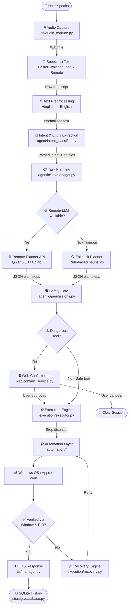
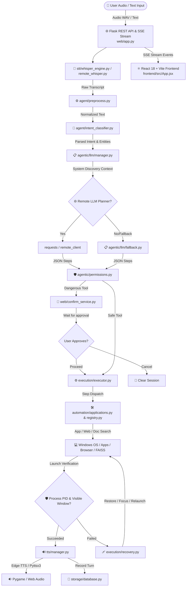
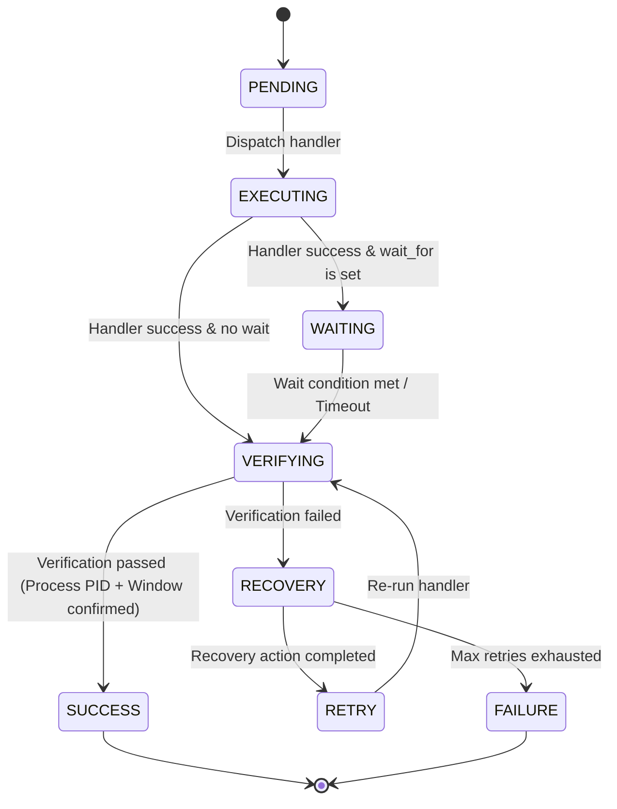
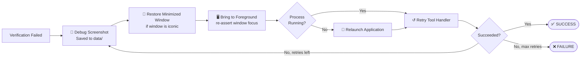

<div align="center">


<br/><br/>

# 🎙️ AI Voice Assistant

### *Speech → Plan → Action. Hands-free Windows desktop control powered by local AI.*

A Windows-native voice automation assistant that translates natural speech (including **Hinglish**) into executable OS action graphs — launching apps, browsing the web, searching documents, automating text, and sending messages, all without touching a mouse.

<br/>

[ ·
[Architecture](#-system-architecture) ·
[Installation](#-installation-guide) ·
[Usage Examples](#-usage-examples) ·
[Roadmap](#-roadmap)]

</div>

---

## 📋 Table of Contents

| Section | Description |
|---|---|
| [🎬 Demo](#-demo) | Screenshots and GIF placeholders |
| [🔍 Project Overview](#-project-overview) | What it is, what problem it solves |
| [✨ Features](#-features) | Full feature matrix |
| [🔄 Project Workflow](#-project-workflow) | End-to-end Mermaid flowchart |
| [🏗 System Architecture](#-system-architecture) | Component diagram and data flows |
| [⚙️ Detailed Execution Pipeline](#-detailed-execution-pipeline) | Stage-by-stage breakdown |
| [🔁 Stateful Execution Engine](#-stateful-execution-engine) | State machine, wait utils, launch verification, recovery |
| [📁 Folder Structure](#-folder-structure) | Directory tree |
| [🧩 Module Explanation](#-module-explanation) | Per-module reference |
| [🛠 Technology Stack](#-technology-stack) | Libraries and frameworks |
| [⚙️ Configuration](#️-configuration) | Environment variables |
| [🚀 Installation Guide](#-installation-guide) | Setup steps and troubleshooting |
| [💬 Usage Examples](#-usage-examples) | Voice → Plan → Result walkthroughs |
| [🧪 Testing](#-testing) | Test suite overview |
| [⚠️ Current Limitations](#️-current-limitations) | Honest capability boundaries |
| [🗺 Roadmap](#-roadmap) | Planned improvements checklist |

---

## 🎬 Demo

<div align="center">

<!-- PLACEHOLDER: Replace with actual demo GIF (screen recording of voice command → app launch) -->
> 📹 **Demo GIF** — *Record a short screen capture of a voice command and drop it here.*
> Suggested: `docs/assets/demo.gif`

```
┌─────────────────────────────────────────────────────┐
│                                                     │
│          [ 🎬 Demo GIF Placeholder ]                │
│      Voice command → App launches automatically     │
│                                                     │
└─────────────────────────────────────────────────────┘
```

<!-- PLACEHOLDER: Dashboard screenshot -->
> 🖥️ **Dashboard Screenshot** — `docs/assets/dashboard.png`

<!-- PLACEHOLDER: Confirmation dialog screenshot -->
> 🔒 **Safety Confirmation Dialog** — `docs/assets/confirm_dialog.png`

<!-- PLACEHOLDER: Voice recording animation -->
> 🎤 **Voice Recording Waveform** — `docs/assets/recording_animation.gif`

<!-- PLACEHOLDER: Execution result screenshot -->
> ✅ **Execution Result Panel** — `docs/assets/execution_result.png`

</div>

---

## 🔍 Project Overview

### What is this project?

This project is a Windows-compatible voice-control application that maps **speech or text inputs** to executable **action graphs (plans)** on the host computer. It combines:

- 🎤 **Local speech-to-text** (Faster-Whisper, quantized model inference or remote Colab GPU offloading)
- 🧠 **Pattern-based NLP** (Hinglish normalization, intent classification, entity slot extraction)
- 🌐 **LLM task planning** (remote Qwen3-8B / Colab API with offline heuristic fallback)
- 🖥️ **Multi-tiered application resolution & launch verification** (Start Apps, Win32 App Paths, UWP, WSL, PATH executables)
- 📂 **Contextual document retrieval** (drive-wide semantic search with FAISS, BM25, and multi-format extractors)
- 🌐 **Modern web UI & streaming engine** (React 18 + Vite dashboard with Server-Sent Events live visualizer)

### What problem does it solve?

It eliminates manual user interaction — mouse clicking, keyboard typing, directory navigating, menu searching — for common desktop workflows. By listening to natural commands, it:

- Resolves and launches installed desktop applications or web-first services
- Searches local documents, drive locations, and the web
- Automates text typing, Notepad sessions, and file management
- Sends WhatsApp messages via web automation
- Monitors stateful execution and recovers automatically when steps stall

...all completely hands-free.

### Who is it for?

| Audience | Use Case |
|---|---|
| 🧑‍💻 Power users | Hands-free desktop control via voice |
| ♿ Accessibility developers | Building system integrations for users with mobility impairments |
| 🤖 Automation engineers | Exploring voice-driven OS agent execution |

### How is it different from a basic speech recognizer?

A basic speech recognizer only transcribes audio to text. This assistant:

- Parses **semantic intents** and resolves contextual references (*"it"*, *"here"*)
- **Dynamically resolves** local applications across UWP, Start Menu, Registry, WSL, and PATH
- Performs **strict launch verification** (gates success on visible window & foreground state rather than raw process creation)
- Protects slow-starting applications with a **time-limited launch guard**
- Employs **contextual document search** using hybrid FAISS vector embeddings and BM25 ranking
- Streams real-time pipeline status to a **React + Vite frontend** via Server-Sent Events (SSE)
- Manages **stateful execution logs** in an SQLite database and stops dangerous operations via confirmation gates

---

## ✨ Features

> Only features **fully implemented** in the codebase are listed below.

| Feature | Module | Status |
|---|---|:---:|
| 🎤 Voice Recording (silence detection) | `stt/audio_capture.py` | ✅ |
| 📝 Local Speech-to-Text (Faster-Whisper) | `stt/whisper_engine.py` | ✅ |
| 🌐 Remote STT (Colab GPU server) | `stt/remote_whisper.py` | ✅ |
| 🔤 Hinglish Normalization | `agent/preprocess.py` | ✅ |
| 🧠 Intent Classification | `agent/intent_classifier.py` | ✅ |
| 🎯 Entity Slot Extraction | `agent/entity_extractor.py` | ✅ |
| 📡 Remote LLM Planner | `agentic/llm/manager.py` | ✅ |
| 📋 Rule-Based Fallback Planner | `agentic/llm/fallback.py` | ✅ |
| 🔍 Desktop Resource & App Discovery | `agentic/discovery/apps.py` | ✅ |
| 🖥️ Multi-Tiered App Resolution | `automation/applications.py` | ✅ |
| 🛡️ Strict Launch Verification & Guard | `automation/applications.py`, `execution/verifier.py` | ✅ |
| 🌐 Web-First Target Routing | `automation/applications.py` | ✅ |
| 📂 Contextual Document Search (FAISS + BM25) | `agentic/document_retrieval/` | ✅ |
| 📝 Notepad & Text Automation | `automation/notepad.py` | ✅ |
| 🛡️ Safety Confirmation Gate | `agentic/permissions.py`, `web/confirm_service.py` | ✅ |
| 🖥️ Desktop & Win32 Automation | `automation/desktop.py` | ✅ |
| 📁 File System Management | `automation/filesystem.py` | ✅ |
| 🌍 Browser Automation | `automation/browser.py` | ✅ |
| 💬 WhatsApp Web Automation | `automation/whatsapp.py` | ✅ |
| 🔊 Neural TTS (Edge-TTS) | `tts/edge_engine.py` | ✅ |
| 🔈 Offline TTS Fallback (Pyttsx3) | `tts/pyttsx3_engine.py` | ✅ |
| 💾 SQLite Session History | `storage/database.py` | ✅ |
| 🔄 Stateful Execution Engine | `execution/executor.py` | ✅ |
| 🩹 Automated Failure Recovery | `execution/recovery.py` | ✅ |
| ⚛️ React 18 + Vite Dashboard | `frontend/` | ✅ |
| 📡 SSE Live Execution Stream | `web/stream_service.py` | ✅ |
| 🔗 Multi-step Execution Workflows | — | 🚧 Partial |
| 👁️ OCR / Vision Integration | — | 🔲 Planned |
| 🔔 Wake Word Detection | — | 🔲 Planned |

---

## 🔄 Project Workflow

The complete end-to-end pipeline from voice input to system action:



---

## 🏗 System Architecture

The following diagram maps all components, streams, and data flows:



---

## ⚙️ Detailed Execution Pipeline

<details>
<summary><strong>📖 Click to expand all pipeline stages</strong></summary>

### Stage 1 — Audio Capture

| Property | Value |
|---|---|
| **Module** | `stt/audio_capture.py` |
| **Input** | Physical acoustic signals from microphone |
| **Output** | Temporary `.wav` file path on disk |
| **Key Classes** | `AudioRecorder` |
| **Key Functions** | `record()`, `record_until_silence()` |
| **Failure Cases** | No default microphone, sounddevice query failure |
| **Recovery** | Falls back to warning logs and empty recording blocks |

---

### Stage 2 — Speech-to-Text

| Property | Value |
|---|---|
| **Module** | `stt/whisper_engine.py`, `stt/remote_whisper.py` |
| **Input** | WAV file path |
| **Output** | `TranscriptionResult` — transcribed text, language details, timing |
| **Key Classes** | `WhisperSTT`, `RemoteWhisperSTT` |
| **Key Functions** | `transcribe()` |
| **Model** | `deepdml/faster-whisper-large-v3-turbo-ct2` (local) or Colab GPU server |
| **GPU Mode** | `float16` on CUDA, `int8` on CPU |
| **Failure Cases** | Model download failure, remote server timeout |
| **Recovery** | Falls back to local Whisper engine or empty transcript with warning |

---

### Stage 3 — Text Preprocessing

| Property | Value |
|---|---|
| **Module** | `agent/preprocess.py` |
| **Input** | Raw text string |
| **Output** | Normalized, clean English string |
| **Key Classes** | `TextPreprocessor` |
| **Key Functions** | `normalize_text()`, `tokenize()` |
| **Capabilities** | Hinglish → English, typo correction, punctuation removal |
| **Failure Cases** | Long strings with non-ASCII symbols |
| **Recovery** | Keeps raw alphanumeric tokens, discards unmapped symbols |

---

### Stage 4 — Intent & Entity Extraction

| Property | Value |
|---|---|
| **Modules** | `agent/intent_classifier.py`, `agent/entity_extractor.py` |
| **Input** | Normalized string |
| **Output** | `CommandIntent` — intent string, entities dict, confidence score |
| **Key Classes** | `IntentClassifier`, `EntityExtractor` |
| **Key Functions** | `classify()`, `extract_entities()`, `rank_intents()` |
| **Failure Cases** | Sentence matches multiple conflicting patterns |
| **Recovery** | Splits on conjunctions; returns highest-scoring intent |

---

### Stage 5 — Planning Layer

| Property | Value |
|---|---|
| **Modules** | `agentic/llm/manager.py`, `agentic/llm/fallback.py` |
| **Input** | Transcript string + system discovery context dict |
| **Output** | `PlannerOutput` — reasoning + list of action steps |
| **Key Classes** | `PlannerManager` |
| **Key Functions** | `plan()`, `apply_heuristic_fallback()`, `_inject_context()` |
| **Failure Cases** | Remote API timeout, JSON schema mismatch |
| **Recovery** | Activates `apply_heuristic_fallback()` for offline rule-based planning |

---

### Stage 6 — Safety Gate

| Property | Value |
|---|---|
| **Modules** | `agentic/permissions.py`, `web/confirm_service.py` |
| **Input** | `PlannerOutput` plan step details |
| **Output** | Execution permit OR blocked confirmation UUID |
| **Key Classes** | `PermissionManager`, `PendingActionManager` |
| **Key Functions** | `check_permissions()`, `handle_confirm()` |
| **Failure Cases** | User closes browser during a safety block |
| **Recovery** | Ephemeral confirmation states expire automatically after 60 seconds |

---

### Stage 7 — Execution & Verification Engine

| Property | Value |
|---|---|
| **Module** | `execution/executor.py`, `execution/verifier.py` |
| **Input** | `ExecutionPlan` with action steps (`wait_for`, `timeout`, `requires`) |
| **Output** | List of step-by-step results with lifecycle states and `LaunchVerification` metadata |
| **Key Classes** | `DesktopExecutor`, `StepRecord`, `ExecutionContext`, `StepStatus` |
| **Key Functions** | `execute()`, `execute_step()`, `dispatch_wait()`, `dispatch_verify()`, `recover_step()` |
| **Failure Cases** | App unresponsive, window fails to load, UI focus mismatch |
| **Recovery** | State machine: screenshot → restore → focus → relaunch → retry (up to `max_retries`, default: 2) |

---

### Stage 8 — Automation & Document Retrieval Layer

| Property | Value |
|---|---|
| **Module** | `automation/*`, `agentic/document_retrieval/*` |
| **Input** | Execution payload arguments |
| **Output** | `ExecutionResult` model |
| **Drivers / Engines** | PyAutoGUI, Win32 APIs, Playwright, FAISS vector index, BM25 ranking, `subprocess` |
| **Key Functions** | `open_application()`, `open_browser()`, `find_document_by_context()`, `send_whatsapp_message()`, `automate_notepad_typing()` |
| **Failure Cases** | Playwright Chromium locks, OS lock-screen blocks |
| **Recovery** | Returns failed `ExecutionResult` to trigger executor recovery logic |

</details>

---

## 🔁 Stateful Execution Engine

The execution engine is built around a **state-aware sequential state machine** that validates each action before proceeding to the next step.

### Step Lifecycle



| State | Description |
|---|---|
| `PENDING` | Step is queued and waiting to run |
| `EXECUTING` | Registered tool handler is actively running |
| `WAITING` | Engine is polling for a post-execution readiness condition |
| `VERIFYING` | Engine inspects OS state (PID, visible window, foreground focus) |
| `RECOVERY` | Verification failed; recovery engine applies corrective strategies |
| `RETRY` | Tool handler is executed again after recovery |
| `SUCCESS` | Terminal: step completed successfully |
| `FAILURE` | Terminal: remaining plan steps are aborted |

---

### Desktop Application Resolution & Verification Architecture

The application resolution layer in `automation/applications.py` uses a multi-tiered discovery pipeline to eliminate execution failures and prevent false-positive launches.

#### 1. Multi-Tiered Resolution Order
1. **Canonical Aliases & Executables**: Maps common names (`word`, `calc`, `cmd`, `vscode`, `spotify`, `notepad`) to system executables or URI protocols.
2. **Web-First Target Routing (`KNOWN_WEB_DESTINATIONS`)**: Targets like **Gmail, YouTube, GitHub, Google Drive, ChatGPT, Spotify, WhatsApp, Telegram**, or web Office links automatically route to browser execution rather than failing desktop lookup.
3. **Windows Start Apps Index (`Get-StartApps`)**: Queries PowerShell `Get-StartApps` with in-memory caching to resolve UWP applications and Start Menu shortcuts.
4. **Win32 App Paths Registry**: Searches `HKLM` and `HKCU` under `Software\Microsoft\Windows\CurrentVersion\App Paths` for installed desktop application paths.
5. **PATH Executable Search**: Performs `shutil.which` lookups across system environment paths.
6. **WSL / Linux Distribution Launcher**: Detects installed WSL distros (`wsl.exe -l -q`) for commands referencing Ubuntu or Linux terminals.

#### 2. Strict Launch Verification (`LaunchVerification`)
Process creation alone is **not** considered successful execution. Application success is gated through strict launch verification:

- `pid`: Verifies active process ID created by `subprocess.Popen` or `os.startfile`.
- `window_found` & `window_visible`: Confirms a visible window handle (`win32gui`) exists for the process.
- `foreground`: Verifies whether the window was successfully brought to host foreground focus.
- `status`: Returns `verified_open`, `already_open`, `launched_no_window`, or `failed`.

> Strict launch verification is designed to reduce false-positive execution results by validating actual visible OS window states before declaring success.

#### 3. Launch Guard (`_LAUNCH_GUARD`)
To prevent unnecessary duplicate process creation when launching slow-starting applications, the system maintains a time-limited `_LAUNCH_GUARD` tracking recent app launch timestamps with a 5.0-second cooldown period.

---

### Contextual Document Search Engine

Implemented in `agentic/document_retrieval/`, the document retrieval system allows searching host files by filename or semantic context:

- **Drive & Folder Scope**: Scans drive roots (`C:\`, `D:\`, etc.) and user priority locations (`Desktop`, `Documents`, `Downloads`, `Pictures`, `Projects`, `OneDrive`).
- **Hybrid Retrieval**: Combines local `all-MiniLM-L6-v2` dense vector embeddings indexed with **FAISS** (`faiss-cpu`) alongside **BM25** sparse keyword ranking.
- **Document Extractors**: Extracts text from PDF (`PyMuPDF`), Word (`python-docx`), PowerPoint (`python-pptx`), Excel (`openpyxl`), Markdown, Text, and JSON.

---

### Intelligent Wait Utilities

Instead of bare `time.sleep()` calls, the engine uses condition-polling primitives from `execution/wait_utils.py`:

| Utility | Condition Polled |
|---|---|
| `wait_until_process_running(name)` | `psutil` process list — waits until app appears |
| `wait_until_window_exists(title)` | `win32gui` — waits until window title is visible |
| `wait_until_window_active(title)` | Waits for target window to become foreground |
| `wait_until_application_ready(name)` | Composite: process + window + active |
| `wait_until_element_ready(label)` | Polls coordinate locators for a specific UI element |
| `wait_until_browser_loaded()` | Monitors browser window title stability |

---

### Automated Failure Recovery

If a step fails verification, the engine applies recovery strategies in priority order (up to `max_retries = 2`):



---

## 📁 Folder Structure

```
AI-VOICE-ASSISTANT/
│
├── 🧠 agent/                          # Local NLP pipeline (text → intent)
│   ├── preprocess.py                  # Hinglish normalization, tokenization
│   ├── intent_classifier.py           # Keyword scoring + regex pattern matcher
│   ├── entity_extractor.py            # Slot parameter extraction
│   ├── command_registry.py            # Intent definitions and categories
│   └── schemas.py                     # NLP data models
│
├── 🤖 agentic/                        # High-level agent: planning, memory, discovery
│   ├── llm/
│   │   ├── manager.py                 # Remote + fallback planner orchestrator
│   │   ├── fallback.py                # Rule-based offline planner
│   │   ├── remote_client.py           # Remote Colab LLM API client
│   │   └── schemas.py                 # Planner output models
│   ├── discovery/
│   │   ├── apps.py                    # PowerShell Get-StartApps + UWP scanner
│   │   ├── browser.py                 # Browser bookmark/history extractor
│   │   ├── indexer.py                 # System resource indexer daemon
│   │   └── manager.py                 # Resource resolution router
│   ├── document_retrieval/            # Context-based document search engine
│   │   ├── search.py                  # Semantic + BM25 document query router
│   │   ├── indexer.py                 # Background document chunk & vector indexer
│   │   ├── embeddings.py              # SentenceTransformer embedding loader
│   │   ├── retriever.py               # FAISS vector store & BM25 ranker
│   │   ├── scanner.py                 # Multi-drive recursive folder walker
│   │   └── config.py                  # Supported extensions & path configuration
│   ├── document_search/               # Context document search module
│   ├── file_context_search/           # File context discovery & ranking
│   ├── memory/
│   │   ├── session_state.py           # Singleton session context tracker
│   │   ├── app_context.py             # Active app/window state
│   │   └── pending_action.py          # Confirmation payload manager
│   ├── conversation/
│   │   └── confirmation_manager.py    # Multi-turn confirmation flows
│   ├── permissions.py                 # Safety gate + tool permission checks
│   ├── tool_registry.py               # LLM tool definitions schema
│   └── schemas.py                     # ExecutionPlan, ActionStep models
│
├── 🛠 automation/                     # Low-level OS drivers
│   ├── applications.py                # Multi-tiered app launch & verification
│   ├── browser.py                     # Web browser + search launcher
│   ├── desktop.py                     # Keyboard/mouse simulation, screenshots
│   ├── filesystem.py                  # Folder/file CRUD operations
│   ├── notepad.py                     # Automated Notepad typing & session controls
│   ├── document_retrieval_tool.py     # Document search tool execution handler
│   └── whatsapp.py                    # Playwright WhatsApp Web automation
│
├── ⚙️ execution/                      # Step-execution state machine
│   ├── executor.py                    # Stateful DesktopExecutor lifecycle
│   ├── registry.py                    # Tool name → handler function map
│   ├── verifier.py                    # Post-step OS state & window verifier
│   ├── recovery.py                    # Failure recovery strategy engine
│   ├── wait_utils.py                  # Intelligent condition-polling primitives
│   ├── step_state.py                  # StepRecord, StepStatus, ExecutionContext
│   └── schemas.py                     # ExecutionResult, ExecutionTimer
│
├── 🗣 stt/                            # Speech input processing
│   ├── audio_capture.py               # Microphone recording + silence detection
│   ├── whisper_engine.py              # Local Faster-Whisper engine wrapper
│   └── remote_whisper.py              # Remote Colab GPU Whisper client
│
├── 🔊 tts/                            # Voice response synthesis
│   ├── manager.py                     # TTSManager: engine selector + coordinator
│   ├── edge_engine.py                 # Neural Edge-TTS async client
│   ├── pyttsx3_engine.py              # Offline system TTS fallback
│   └── response_generator.py         # Execution outcome → natural language
│
├── 💾 storage/                        # Persistence layer
│   ├── database.py                    # SQLite CRUD operations
│   └── history_manager.py             # Session log manager
│
├── 🌐 web/                            # Flask web backend + REST/SSE API
│   ├── app.py                         # App factory + server entry point
│   ├── routes.py                      # REST API endpoint definitions
│   ├── services.py                    # Core voice pipeline orchestration
│   ├── stream_service.py              # Server-Sent Events (SSE) streaming service
│   └── confirm_service.py             # Safety confirmation webhook handler
│
├── ⚛️ frontend/                       # React 18 + Vite Web Application
│   ├── src/
│   │   ├── App.jsx                    # Main UI component & stream handler
│   │   ├── components/
│   │   │   ├── desktop/               # LiveExecutionVisualizer, ConfirmationCard, MicRecorder
│   │   │   ├── history/               # HistoryView session log list
│   │   │   ├── notepad/               # NotepadControls, QuickShortcuts
│   │   │   └── search/                # DocumentViewer, FileSearchModal
│   │   └── hooks/                     # usePipelineStream, usePermissions, useAudioRecorder
│   ├── package.json                   # Frontend npm dependencies
│   └── vite.config.js                 # Vite proxy & build configuration
│
├── 🧪 tests/                          # 30-file test suite
├── 📊 evaluation/                     # Pipeline evaluation benchmark runner
├── 📜 scripts/                        # Dev utilities and startup helpers
├── 📓 colab_stt_server.ipynb          # Colab GPU Whisper server notebook
├── 📓 colab_rag_server.ipynb          # Colab GPU RAG server notebook
├── 📓 colab_inference_server.ipynb   # Colab GPU LLM planner server notebook
├── config.py                          # Central configuration (loaded from .env)
├── .env.example                       # Environment variable template
└── requirements.txt                   # Central Python dependencies
```

---

## 🧩 Module Explanation

<details>
<summary><strong>🧠 NLP Agent Layer — click to expand</strong></summary>

### `agent/preprocess.py`

| Field | Detail |
|---|---|
| **Purpose** | Translates Hinglish → English, fixes typos, removes punctuation |
| **Classes** | `TextPreprocessor` |
| **Functions** | `normalize_text()`, `tokenize()` |
| **Input** | Raw string text |
| **Output** | Normalized clean string or token list |
| **Dependencies** | `re`, `logging` |
| **Called By** | `agent/intent_classifier.py` |

---

### `agent/intent_classifier.py`

| Field | Detail |
|---|---|
| **Purpose** | Matches normalized text to named intents via keyword scoring and regex |
| **Classes** | `IntentClassifier` |
| **Functions** | `classify()`, `rank_intents()` |
| **Input** | Clean normalized string |
| **Output** | `CommandIntent` structures |
| **Dependencies** | `re`, `dataclasses`, `command_registry`, `entity_extractor` |
| **Called By** | `web/services.py` |

---

### `agent/entity_extractor.py`

| Field | Detail |
|---|---|
| **Purpose** | Extracts slot variables from transcripts (app names, paths, contacts, queries) |
| **Classes** | `EntityExtractor` |
| **Functions** | `extract_entities()` |
| **Input** | Utterance string + intent parameters |
| **Output** | Dict of extracted slot values |
| **Dependencies** | `logging`, `re` |
| **Called By** | `agent/intent_classifier.py` |

</details>

<details>
<summary><strong>🤖 Planning & Discovery Layer — click to expand</strong></summary>

### `agentic/llm/manager.py`

| Field | Detail |
|---|---|
| **Purpose** | Orchestrates remote planning requests and offline fallbacks |
| **Classes** | `PlannerManager` |
| **Functions** | `plan()`, `_inject_context()` |
| **Input** | Transcription string |
| **Output** | `PlannerOutput` plan step models |
| **Dependencies** | `json`, `requests`, `fallback.py`, `discovery/indexer.py` |
| **Called By** | `web/services.py` |

---

### `agentic/llm/fallback.py`

| Field | Detail |
|---|---|
| **Purpose** | Rule-based planner mapping transcriptions to steps when offline |
| **Functions** | `apply_heuristic_fallback()` |
| **Input** | Transcript string |
| **Output** | `PlannerOutput` plan steps |
| **Called By** | `agentic/llm/manager.py` |

---

### `agentic/discovery/apps.py`

| Field | Detail |
|---|---|
| **Purpose** | Queries Windows Start Menu apps via PowerShell `Get-StartApps` with caching |
| **Functions** | `get_start_apps()`, `find_start_app()` |
| **Output** | Dict of AppUserModelID and app display names |
| **Called By** | `automation/applications.py` |

---

### `agentic/document_retrieval/search.py`

| Field | Detail |
|---|---|
| **Purpose** | Drive-wide document search using semantic FAISS embeddings & BM25 ranking |
| **Functions** | `find_document_by_context()`, `open_document_result()` |
| **Dependencies** | `faiss`, `sentence_transformers`, `rank_bm25`, `fitz` (PyMuPDF), `docx`, `pptx` |
| **Called By** | `automation/document_retrieval_tool.py` |

</details>

<details>
<summary><strong>🛠 Automation Drivers — click to expand</strong></summary>

### `automation/applications.py`

| Field | Detail |
|---|---|
| **Purpose** | Launch process handles, resolve Windows executables/UWP/WSL/Web-first targets, verify launch |
| **Functions** | `open_application()`, `find_windows_app_paths()`, `resolve_wsl_distribution()`, `verify_launch_state()` |
| **Classes** | `LaunchVerification` |
| **Dependencies** | `psutil`, `win32gui`, `win32process`, `subprocess`, `shutil`, `winreg` |

---

### `automation/notepad.py`

| Field | Detail |
|---|---|
| **Purpose** | Automate opening Notepad, focus window, typing text, and save dialog interaction |
| **Functions** | `open_notepad_and_write()`, `type_into_notepad()`, `save_notepad_file()` |
| **Dependencies** | `pyautogui`, `win32gui`, `psutil` |

---

### `automation/browser.py`

| Field | Detail |
|---|---|
| **Purpose** | Launch web links and perform web searches |
| **Functions** | `open_browser()`, `search_web()` |
| **Dependencies** | `webbrowser` |

---

### `automation/filesystem.py`

| Field | Detail |
|---|---|
| **Purpose** | Create files/folders, read content, list files, delete targets |
| **Functions** | `create_folder()`, `create_file()`, `list_files()`, `delete_file()` |
| **Dependencies** | `os`, `shutil` |

---

### `automation/whatsapp.py`

| Field | Detail |
|---|---|
| **Purpose** | Automate sending messages on WhatsApp Web |
| **Functions** | `send_whatsapp_message()` |
| **Dependencies** | `playwright.sync_api` |
| **Note** | Requires manual QR code login on first run |

</details>

<details>
<summary><strong>⚙️ Execution Engine — click to expand</strong></summary>

### `execution/executor.py`

| Field | Detail |
|---|---|
| **Purpose** | Stateful, sequential plan execution with lifecycle management |
| **Classes** | `DesktopExecutor` (alias: `SystemExecutor`) |
| **Functions** | `execute()`, `execute_step()`, `_run_step_lifecycle()`, `_verify_and_recover()` |
| **Dependencies** | `execution/registry`, `execution/wait_utils`, `execution/verifier`, `execution/recovery` |

---

### `execution/verifier.py`

| Field | Detail |
|---|---|
| **Purpose** | Post-step OS state verification (process PID + visible window check) |
| **Functions** | `dispatch_verify()`, `verify_application_launched()`, `_enumerate_all_windows()` |

---

### `execution/recovery.py`

| Field | Detail |
|---|---|
| **Purpose** | Structured failure recovery: restore → focus → relaunch → retry |
| **Functions** | `recover_step()`, `bring_to_foreground()`, `restore_minimized_window()`, `relaunch_application()` |

</details>

<details>
<summary><strong>⚛️ Frontend & Web Streaming — click to expand</strong></summary>

### `web/stream_service.py`

| Field | Detail |
|---|---|
| **Purpose** | Yields Server-Sent Events (SSE) at each stage boundary for real-time visualization |
| **Functions** | `run_pipeline_stream()`, `run_confirmation_stream()` |
| **Events** | `transcript`, `intent`, `entities`, `discovery`, `planner`, `execution`, `response`, `done` |

---

### `frontend/src/App.jsx`

| Field | Detail |
|---|---|
| **Purpose** | React 18 single-page dashboard rendering execution stream, history, and modals |
| **Components** | `LiveExecutionVisualizer.jsx`, `ConfirmationCard.jsx`, `CompletionPopup.jsx`, `FileSearchModal.jsx` |

</details>

---

## 🛠 Technology Stack

| Layer | Technology | Purpose |
|---|---|---|
| **Language** |  Python 3.10/3.11 | Core backend & automation engine |
| **Frontend Framework** |  React 18 + Vite | Modern dashboard UI & streaming visualizer |
| **Web Server** |  Flask + Flask-CORS | REST API endpoints & SSE streaming server |
| **Speech-to-Text** | Faster-Whisper (CTranslate2) | Local or remote quantized transformer STT |
| **Deep Learning** | PyTorch | Model inference backend for Whisper |
| **Document Embeddings** | SentenceTransformers (`all-MiniLM-L6-v2`) | Local dense vector embeddings for documents |
| **Vector Index** | FAISS (`faiss-cpu`) | High-speed vector similarity search |
| **Keyword Search** | BM25 (`rank-bm25`) | Sparse text ranking for document search |
| **Document Parsers** | PyMuPDF, python-docx, python-pptx, openpyxl | Multi-format text extraction |
| **Audio Capture** | sounddevice + scipy + numpy | Microphone recording & VAD silence detection |
| **LLM Planning** | Remote Colab API / Qwen3-8B | Task planning with heuristic offline fallback |
| **Browser Automation** | Playwright (Chromium) | WhatsApp Web & browser control |
| **Desktop Automation** | PyAutoGUI | Cross-platform keyboard/mouse simulation |
| **Win32 Integration** | pywin32 (`win32gui`, `win32process`, `winreg`) | Window handle & registry management |
| **Process Management** | psutil | Running process queries & memory checks |
| **Text-to-Speech** | Edge-TTS (neural, async) | Online voice synthesis |
| **TTS Fallback** | pyttsx3 | Offline system-native speech |
| **Audio Playback** | pygame | PCM audio playback for TTS output |
| **Database** | SQLite (stdlib) | Local session history & logs |
| **Terminal Formatting** | Rich | Colored log output formatting |

---

## ⚙️ Configuration

All configuration lives in [`config.py`](config.py) and is overridable via a `.env` file:

```bash
# Copy the template
copy .env.example .env
```

| Variable | Description | Default |
|---|---|---|
| `LOG_LEVEL` | Logging verbosity (`DEBUG`, `INFO`, `WARNING`, `ERROR`) | `INFO` |
| `FLASK_PORT` | Flask backend port | `5000` |
| `COLAB_API_URL` | URL of remote LLM planning server | `https://…/plan` |
| `COLAB_TIMEOUT` | Network timeout for planner requests (seconds) | `120` |
| `STT_MODEL_ID` | Faster-Whisper model ID on Hugging Face | `deepdml/faster-whisper-large-v3-turbo-ct2` |
| `STT_BEAM_SIZE` | Decode beam size | `5` |
| `STT_VAD_FILTER` | Enable VAD filter to strip silence | `True` |
| `STT_USE_REMOTE` | Route transcription to remote Colab GPU server | `false` |
| `STT_API_URL` | Remote STT `/transcribe` endpoint URL | `https://…/transcribe` |
| `STT_API_TIMEOUT` | HTTP timeout for remote STT requests (seconds) | `60` |
| `SILENCE_THRESHOLD` | RMS amplitude threshold for silence detection | `0.01` |
| `SILENCE_DURATION` | Seconds of silence before recording stops | `2.0` |

---

## 🚀 Installation Guide

### Prerequisites

| Requirement | Version |
|---|---|
| Operating System | Windows 10 or Windows 11 |
| Python | 3.10.x or 3.11.x (added to PATH) |
| Node.js & npm | Node 18+ (for React + Vite frontend) |
| Git | Any recent version |
| Microphone | Default audio input device configured in Windows |

---

### Setup Steps

**1. Clone the repository**
```powershell
git clone https://github.com/Ashmita1206/AI-VOICE-ASSISSTANT.git
cd "AI-VOICE-ASSISSTANT"
```

**2. Create and activate a Python virtual environment**
```powershell
python -m venv .venv
.\venv\Scripts\Activate.ps1
```

**3. Install Python dependencies**
```powershell
pip install -r requirements.txt
```

**4. Install Playwright browser binaries**
```powershell
playwright install chromium
```

**5. Install Frontend dependencies**
```powershell
cd frontend
npm install
cd ..
```

**6. Configure environment variables**
```powershell
copy .env.example .env
# Edit .env with your planner URL or logging preferences
```

**7. Run the application**

In Terminal 1 (Backend Server):
```powershell
python -m web.app
```

In Terminal 2 (Frontend Dev Server):
```powershell
cd frontend
npm run dev
```

Open your browser and navigate to **`http://localhost:5173`** (or `http://localhost:5000`) to access the dashboard.

---

### 🔧 Troubleshooting

<details>
<summary><strong>❌ Pywin32 / DLL Import Failure</strong></summary>

If you receive import errors for `win32gui` or `win32process` on startup, force-reinstall `pywin32` to register the system DLLs:

```powershell
pip install --force-reinstall pywin32
```

</details>

<details>
<summary><strong>❌ Sounddevice / PortAudio Missing Device</strong></summary>

If `sounddevice` warns that no input devices are available:
- Ensure a default microphone is plugged in
- Confirm it is set as the default input device in **Windows Sound Settings**
- Verify no other application has exclusive lock on the device

</details>

<details>
<summary><strong>❌ CUDA / GPU Setup</strong></summary>

By default, the STT engine auto-detects GPU drivers. If CUDA is not installed, the system falls back to **CPU execution with INT8 quantization** — functional but slower.

To enable GPU acceleration:
1. Install **CUDA Toolkit 11.x or 12.x** matching your PyTorch build
2. Verify with `python -c "import torch; print(torch.cuda.is_available())"`

</details>

---

## 💬 Usage Examples

Each example shows the full pipeline: voice input → planner JSON → tool executed → result.

---

### 🌐 Open Browser

```
🎤  User says:   "Open browser"  /  "Browser kholo"
     Normalizes: "browser open"
```

**Planner Output:**
```json
{
  "steps": [
    { "tool": "open_browser", "args": {} }
  ],
  "response": "Opening your browser."
}
```

**Result:** ✅ Default browser opens

---

### 🚀 Launch an Application (with Launch Verification)

```
🎤  User says:   "Open Chrome"
```

**Planner Output:**
```json
{
  "steps": [
    {
      "tool": "launch_application",
      "args": { "application": "chrome" },
      "wait_for": "window_ready",
      "timeout": 15
    }
  ],
  "response": "Launching Chrome."
}
```

**Result:** ✅ Chrome launches via `find_windows_app_paths`, process ID and visible window are verified via `LaunchVerification`, and window is brought to foreground.

---

### 📂 Search Documents by Context

```
🎤  User says:   "Find my project proposal document"
```

**Planner Output:**
```json
{
  "steps": [
    {
      "tool": "find_document_by_context",
      "args": { "query": "project proposal" }
    }
  ],
  "response": "Searching documents for project proposal."
}
```

**Result:** ✅ Drive-wide FAISS vector search and BM25 rank documents across PDF, Word, and text files, presenting matching paths in the Document Viewer.

---

### 🔒 Delete a File (Safety Gate Triggered)

```
🎤  User says:   "Delete report.pdf"
```

**Planner Output:**
```json
{
  "steps": [
    { "tool": "delete_file", "args": { "path": "report.pdf" } }
  ]
}
```

**Pipeline:** ⚠️ `delete_file` is a **dangerous tool** → Safety gate blocks execution → Web dashboard shows:

> *"Are you sure you want to delete report.pdf?"*  **[Proceed]** | **[Cancel]**

**Result:** ✅ File deleted only after explicit user confirmation — or ❌ cancelled if user clicks Cancel

---

### 💬 Send a WhatsApp Message (Safety Gate Triggered)

```
🎤  User says:   "Message Harshita and write hi"
```

**Planner Output:**
```json
{
  "steps": [
    {
      "tool": "send_whatsapp_message",
      "args": { "contact": "Harshita", "message": "hi" }
    }
  ]
}
```

**Pipeline:** ⚠️ Confirmation required → User approves → Playwright opens WhatsApp Web and sends message

**Result:** ✅ Message delivered to Harshita on WhatsApp Web

---

## 🧪 Testing

The project contains a comprehensive **30-file** test suite in [`tests/`](tests/).

### Test Coverage

| Area | Test Files |
|---|---|
| NLP Pipeline | `test_nlp_preprocess.py`, `test_nlp_intent_classifier.py`, `test_nlp_entity_extractor.py`, `test_nlp_pipeline.py`, `test_nlp_schemas.py`, `test_nlp_command_registry.py` |
| Planning | `test_remote_planner.py` |
| Memory & Session | `test_memory.py`, `test_confirm_api.py`, `test_confirmation.py` |
| App Discovery & Resolution | `test_agentic_discovery.py`, `test_resolution.py`, `test_generic_launch_architecture.py` |
| Document Search | `test_document_search.py`, `test_document_retrieval.py`, `test_remote_embeddings.py` |
| Execution Engine | `test_stateful_executor.py`, `test_executor.py`, `test_execution_dispatch.py`, `test_execution_pipeline_fix.py` |
| Automation | `test_automation.py`, `test_launch_and_confirm.py`, `test_notepad.py`, `test_spotify_automation.py`, `test_whatsapp_automation.py` |
| Permissions | `test_permissions.py`, `test_interrupts.py` |
| Storage & Persistence | `test_storage_persistence.py` |
| TTS & Web API | `test_tts.py`, `test_web_api.py` |

### Running Tests

```powershell
# Run the full test suite
.\venv\Scripts\python -m pytest tests/ -v

# Run a specific execution test file
.\venv\Scripts\python -m pytest tests/test_execution_pipeline_fix.py -v
```

---

## ⚠️ Current Limitations

> These are **honest** descriptions of current technical boundaries. No capabilities are exaggerated.

| Limitation | Details |
|---|---|
| 🪟 **Windows-only** | Low-level `win32gui` calls, UWP app discovery (`Get-StartApps`), and registry shortcut indexing rely on Windows APIs. macOS/Linux are not supported. |
| 🖱 **Active UI Focus Required** | PyAutoGUI dispatches keystrokes to the active foreground window. If the user locks the screen, automated typing tasks may fail or target the wrong window. |
| 👁 **No Visual Reasoning (OCR/Vision)** | The assistant cannot analyze on-screen elements visually. It relies on process parameters, window handles, accessibility trees, and pre-calculated bounds. |
| 💬 **WhatsApp Web Login** | Automated messaging requires manual QR code login on first run (Playwright shares the Chromium profile folder). |
| 🌐 **Remote Planner Dependency** | The default planning engine requires an active HTTP connection to the external Colab LLM API. Offline mode uses rule-based fallback only. |
| 🔗 **Multi-step Workflows** | 🚧 Partially implemented. Sequential execution works but complex inter-step dependencies and branching are not fully tested. Do not rely on this for production multi-step flows. |

---

## 🗺 Roadmap

```
Core Features
 [x] Faster-Whisper local speech-to-text
 [x] Hinglish normalization
 [x] Intent classification + entity extraction
 [x] Remote LLM planner (Qwen3-8B / Colab API)
 [x] Rule-based fallback planner
 [x] Multi-tiered app resolution & launch verification
 [x] Time-limited launch guard (duplicate suppression)
 [x] Web-first destination target routing
 [x] Contextual document search (FAISS + BM25)
 [x] Safety confirmation gate (web UI)
 [x] Desktop & Notepad automation (PyAutoGUI + Win32)
 [x] Browser automation (Playwright)
 [x] WhatsApp Web messaging
 [x] File system management
 [x] SQLite session history
 [x] Neural TTS (Edge-TTS) + offline fallback (Pyttsx3)
 [x] Stateful execution engine (state machine)
 [x] Automated failure recovery (screenshot, refocus, relaunch)
 [x] React 18 + Vite Web Dashboard with SSE live execution stream
 [x] Remote STT (Colab GPU server)

In Progress
 [~] Multi-step execution workflows (partial implementation)

Planned
 [ ] OCR / Computer Vision (click text labels without coordinates)
 [ ] Wake word detection (Porcupine / Snowboy)
 [ ] Self-healing parameter resolution (alternate path search on errors)
 [ ] Cross-platform support (macOS / Linux drivers)
 [ ] Voice command history replay
 [ ] Plugin / tool extension system
```

---

## 📄 License

This project is licensed under the **MIT License** — see the [LICENSE](LICENSE) file for details.

---

<div align="center">

**Built with ❤️ for hands-free Windows automation**

⭐ Star this repository if you find it useful!

</div>
